<p align="center">
  
</p>

<h1 align="center">XSVO-main</h1>

<p align="center">
  <a href="https://github.com/xsvo/XSVO-main"></a>
  <a href="VERSION"></a>
  <a href="LICENSE"></a>
  <a href="https://vercel.com/"></a>
  <a href="https://nextjs.org/"></a>
</p>

<p align="center">
  演示站：<a href="https://www.xsvo.com">www.xsvo.com</a>
</p>

XSVO让创作更简单。XSVO 是一款面向 AI 图片创作、素材管理和视觉方案迭代的开源工作台。它把无限画布、AI 生成、参考图编辑、提示词库、素材沉淀、用户权限、管理员配置和本地 Agent 能力放到同一个工作流里，适合个人创作者、本地部署场景和小团队内部使用。

XSVO 当前版本为 `v0.1.1`，这是基于 VOZEB 与原开源项目 [basketikun/infinite-canvas](https://github.com/basketikun/infinite-canvas) 继续开发的二开版本。感谢原创作者 basketikun 对无限画布、AI 创作工作流、Canvas Agent 和 Codex 插件能力的开源贡献。

版本更新记录请查看 [GitHub Releases](https://github.com/xsvo/XSVO-main/releases)。

> [!CAUTION]
> 项目仍处于快速开发阶段，不保证历史数据兼容。当前更适合个人或本地部署，不建议直接公网多人共用。

## 功能总览

- 无限画布：多画布项目、节点拖拽缩放、连线、小地图、撤销重做、导入导出。
- AI 图片创作：支持文生图、图生图、参考图编辑、图片反推提示词、图片切图、局部蒙版修改和图片放大。
- 音频与视频：支持音频节点、视频生成、声音/水印配置，以及图片、视频、音频参考输入。
- 画布助手：围绕选中节点和上游节点对话、生图，并把结果插回当前画布。
- 提示词库：支持公共提示词库、我的提示词、标签、分类、封面和提示词素材沉淀；管理员公共提示词会采集原作者接入的远程提示词源，并只保留可访问的远程图片 URL。后台公共提示词管理支持搜索、多选和批量删除。
- 素材管理：支持图片、文本、视频等素材保存、复用、导入导出和 WebDAV 同步。
- 用户系统：支持账号密码注册登录、邮箱注册开关、SMTP 邮箱服务配置、管理员后台、用户角色、账号状态、积分余额和签到奖励。
- 通用接口：管理员可配置 OpenAI 兼容接口、系统模型渠道、默认模型，并允许或禁止用户自配接口。
- 本地 Agent：通过本机 Canvas Agent 连接 Codex / Claude Code，让 Agent 通过 MCP 操作当前画布。
- Codex App 插件：提供 Codex app 插件，安装后可自动注册 MCP 并尝试拉起本地 Agent。
- 版本更新：管理员右上角版本入口可查看更新记录，并从 `xsvo/XSVO-main` 检查最新版本；普通用户端隐藏 GitHub 和版本入口。

## 使用教程

### 1. 低配服务器部署

0.5G 到 2G 内存服务器建议使用发布镜像，不在服务器现场构建源码：

```bash
git clone https://github.com/xsvo/XSVO-main.git
cd XSVO-main
docker compose pull
docker compose up -d
```

默认 `docker-compose.yml` 使用 `ghcr.io/xsvo/xsvo-main:latest`，只会拉取预构建镜像并启动容器，不会执行 `next build`。账号、后台设置、签到记录和公共提示词会保存在 `xsvo-main-data` 数据卷里。

### 2. 首次初始化

打开 `http://服务器IP:4000`，第一次注册的账号会自动成为管理员。这个首个管理员账号用于初始化站点，管理员登录后可进入 `管理员后台`，配置网站标题、Logo、SEO、注册策略、邮箱服务、模型渠道、默认模型、用户积分和公共提示词库。

### 3. 配置邮箱注册

进入 `管理员后台 -> 系统设置 -> 账号策略` 打开“邮箱注册”。再进入同页的“邮箱服务”填写 SMTP：

```text
QQ 邮箱：smtp.qq.com / 465 / SSL 开启
网易邮箱：填写网易提供的 SMTP、端口和授权码
企业邮箱：填写服务商提供的 SMTP、端口、SSL 和授权码
```

保存前可以点击“测试邮箱”。测试成功后，普通用户注册必须获取 6 位邮箱验证码；未验证邮箱不能直接创建账号。忘记密码和修改绑定邮箱也会复用这套 SMTP。

### 4. 用户与账号管理

普通用户和管理员都可以从右上角账号菜单进入 `个人资料`，修改昵称、绑定邮箱和登录密码。管理员可在后台 `用户管理` 中修改用户昵称、邮箱、角色、状态、积分余额，必要时重置用户密码或删除用户。系统会阻止删除当前管理员和最后一个管理员，避免后台被锁死。

### 5. 首页 Footer 和社交媒体

进入 `管理员后台 -> 网站设置 -> 首页收尾与社交媒体`，可以配置首页底部内容：

```text
版权所有：显示在首页 Footer 左侧
使用条款链接：默认 /terms，也可以填写外部 URL
隐私政策链接：默认 /privacy，也可以填写外部 URL
邮箱联系：默认开启，支持 mailto: 邮箱链接
Telegram：默认开启，可填写频道或联系人链接
X：默认开启，可填写 X 主页链接
Instagram：默认开启，可填写 Instagram 主页链接
```

每个社交媒体都有单独的显示开关。关闭后首页 Footer 不会显示该入口。

### 6. 更新版本

低配服务器更新只需要拉取新镜像并重启：

```bash
docker compose pull
docker compose up -d
```

不要执行 `docker compose down -v`，否则会删除 `xsvo-main-data` 数据卷。升级前也可以在管理员后台概览点击“备份用户数据库”，下载 `.data/auth.json` 和 `.data/prompts.json` 留底。

## 详细功能

### 画布创作

XSVO 的核心工作流围绕无限画布展开。你可以在画布里放置图片、文本、音频、视频和配置节点，通过连线组织上下游关系，用节点工具条进行复制、下载、保存素材、编辑、切图、放大、蒙版局部修改等操作。画布支持多项目管理、导入导出、撤销重做、小地图和快捷键。

### AI 生成

项目支持 OpenAI 兼容接口，浏览器前台可直接请求用户配置的 `Base URL` 和 `API Key`。支持文本问答、文生图、图生图、参考图编辑、音频生成和视频生成。视频生成支持 Seedance 2.0 场景，可通过火山方舟 Agent Plan 接入。

### 提示词与素材

公共提示词由管理员后台维护，会出现在用户端提示词库。后台公共提示词管理支持新增、远程封面 URL、搜索、多选和批量删除，适合维护大型提示词库。用户也可以维护自己的提示词，把稳定的提示词、参考风格和生成结果沉淀为素材。素材库支持本地保存、导入导出和可选 WebDAV 同步，适合长期积累个人创作资产。

### 用户与管理员

XSVO 增加了账号系统和后台管理能力。站点首次注册的账号会自动成为管理员，用于完成初始化配置。管理员可以控制注册是否开放、是否要求邮箱注册，调整用户角色、账号状态、积分余额、签到奖励、系统接口渠道和默认模型。后台采用侧边栏切换布局，概览、系统设置、用户管理和公共提示词库分区更清楚。

管理员还可以在后台“网站设置”中维护前台网站标题、Logo URL、SEO 标题、SEO 描述和关键词。保存后首页、顶部导航、浏览器标题、Open Graph 和 favicon 会同步读取新的站点信息。

### 邮箱注册与 SMTP

进入 `管理员后台 -> 系统设置 -> 账号策略`，打开“邮箱注册”后，普通注册页会要求填写邮箱并获取 6 位验证码；验证码通过后才允许创建账号并登录，邮箱也会校验不能重复。

进入 `管理员后台 -> 系统设置 -> 邮箱服务` 可以配置发信服务。QQ 邮箱默认配置为：

```text
邮箱类型：QQ 邮箱
SMTP 服务器：smtp.qq.com
端口：465
SSL：开启
邮箱账号：你的 QQ 邮箱
授权码 / 密码：QQ 邮箱 SMTP 授权码
发件邮箱：可留空，默认使用邮箱账号
发件名称：XSVO
```

网易邮箱、企业邮箱或其他邮箱服务，把 SMTP 服务器、端口、SSL、邮箱账号和授权码改成服务商提供的参数即可。配置完成后可以点击“测试邮箱”，默认发送到发件邮箱，也可以单独填写测试收件邮箱。忘记密码、注册验证码和修改邮箱验证码都会复用这里的 SMTP 配置。

### Agent 与插件

本地 Canvas Agent 可以连接 Codex / Claude Code，让 Agent 通过 MCP 读取和操作当前画布。仓库同时提供 Codex App 插件，安装后会注册 `xsvo-canvas` MCP，并尝试拉起本地 Agent。部分内部存储 key 仍保留旧名称，以避免破坏已有用户数据和插件兼容性。

## 效果展示

<table width="100%">
  <tr>
    <td width="50%">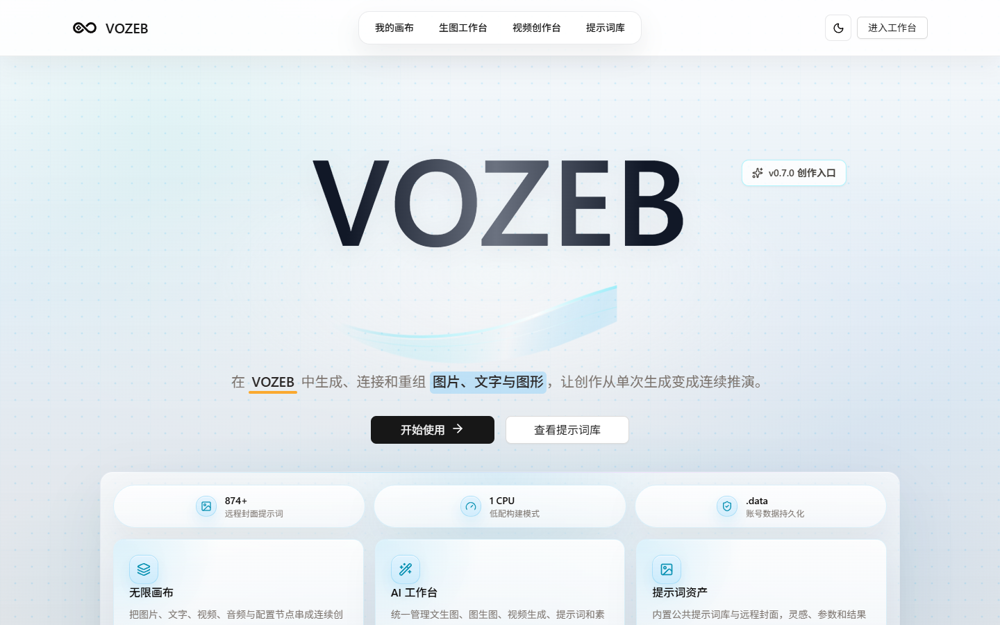</td>
    <td width="50%">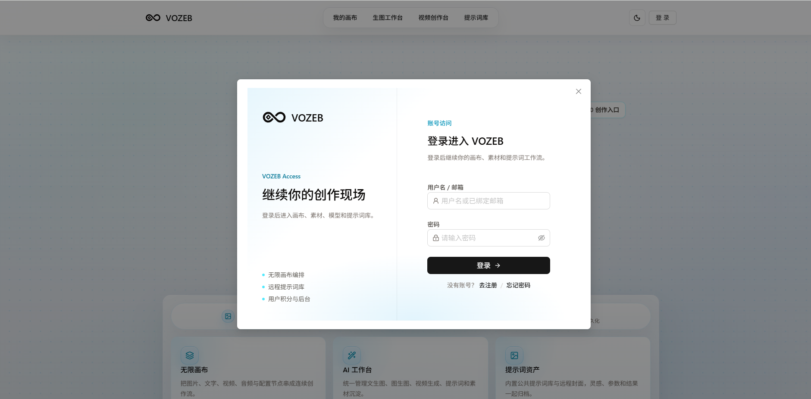</td>
  </tr>
  <tr>
    <td width="50%">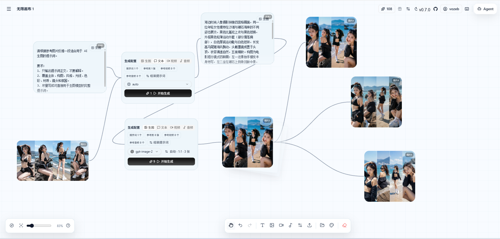</td>
    <td width="50%">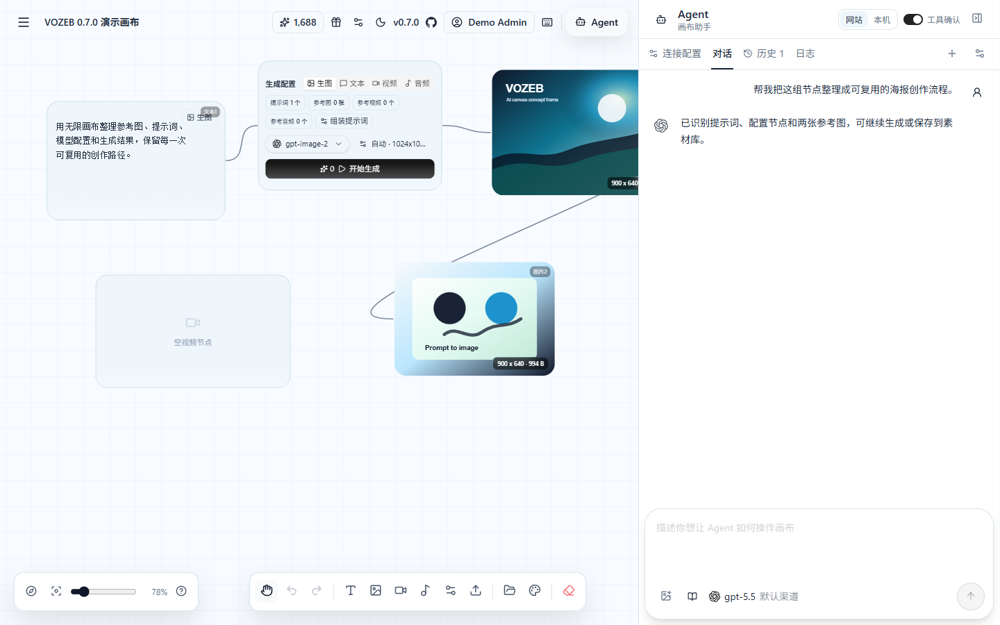</td>
  </tr>
  <tr>
    <td width="50%">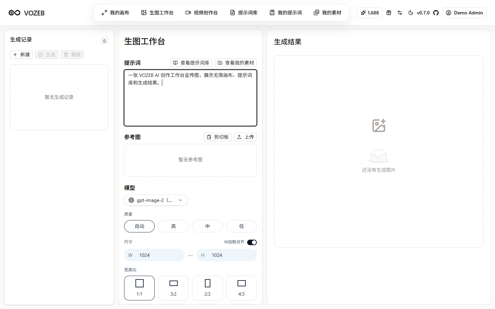</td>
    <td width="50%">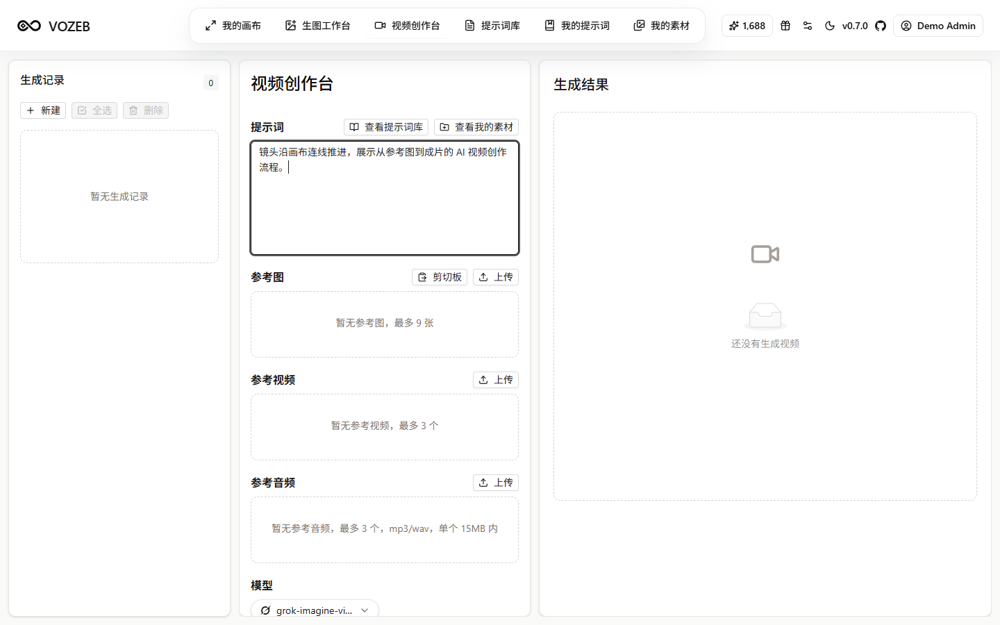</td>
  </tr>
  <tr>
    <td width="50%">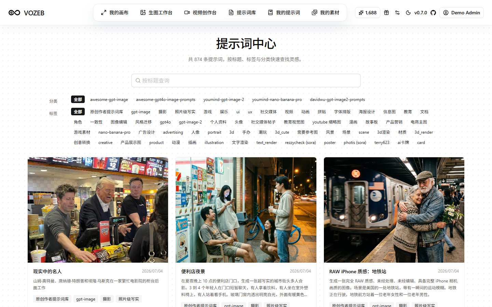</td>
    <td width="50%">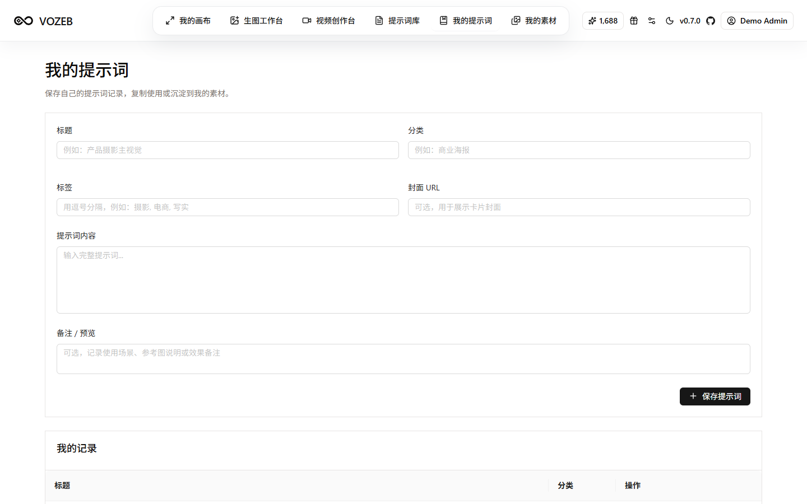</td>
  </tr>
  <tr>
    <td width="50%">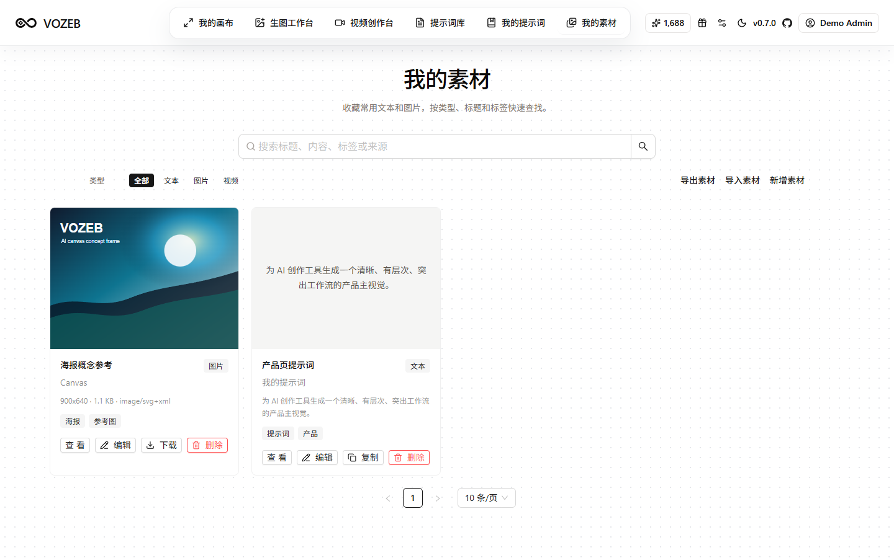</td>
    <td width="50%">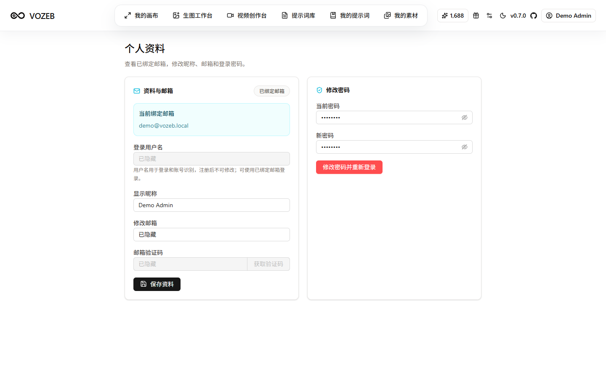</td>
  </tr>
  <tr>
    <td colspan="2">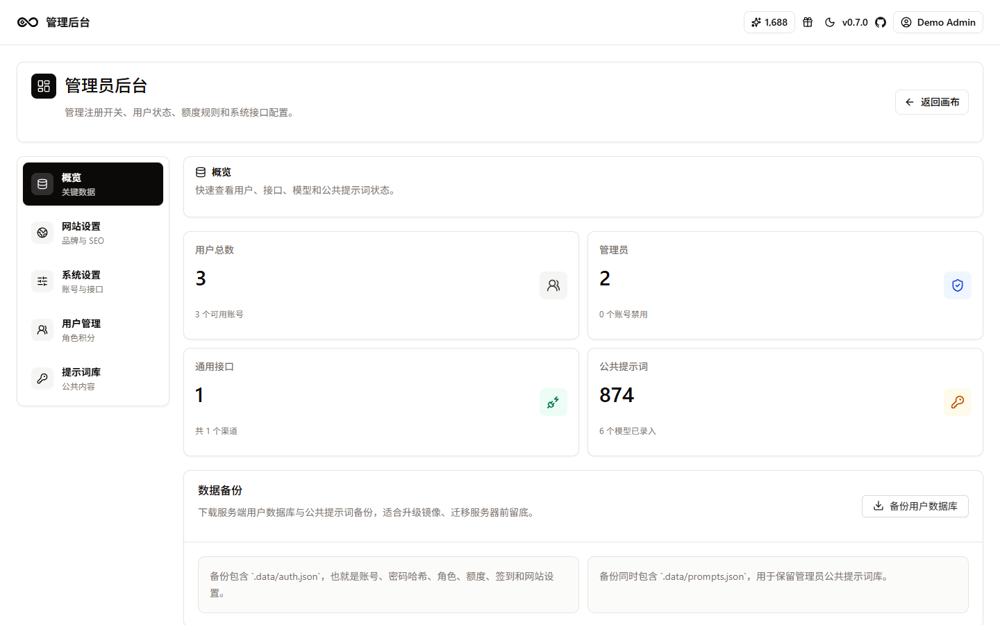</td>
  </tr>
</table>

## 技术栈

- 前端：Next.js、React、TypeScript、Tailwind CSS、Ant Design、Zustand、TanStack Query。
- 存储：浏览器本地存储为主，支持导入导出与可选 WebDAV 同步。
- Agent：Canvas Agent、MCP、Codex / Claude Code 本地集成。
- 部署：Vercel 或 Docker。

## 快速开始

```bash
git clone git@github.com:xsvo/XSVO-main.git
cd XSVO-main/web
pnpm install
pnpm run dev
```

运行后默认端口为 `4000`，可访问 `http://localhost:4000`。

首次打开后进入右上角配置，填入自己的 OpenAI 兼容 `Base URL` 和 `API Key`。

## Docker 运行

低配服务器（包括 0.5G 内存的小机器）建议只使用发布镜像，服务器不执行 `next build`，通常只需要拉镜像和启动容器，才能接近 2 分钟内完成部署：

```yaml
services:
  app:
    image: ghcr.io/xsvo/xsvo-main:latest
    container_name: xsvo-main
    ports:
      - "4000:4000"
    volumes:
      - xsvo-main-data:/app/web/.data
    restart: unless-stopped

volumes:
  xsvo-main-data:
```

账号、后台设置、签到记录和公共提示词会写入容器内 `/app/web/.data`。使用上面的 Compose 配置升级镜像时，`xsvo-main-data` 卷会继续保留这些数据；只有手动执行 `docker volume rm` 或 `docker compose down -v` 才会删除。若你之前用的是没有 volume 的旧容器，请先进入旧容器备份 `/app/web/.data` 再替换镜像。

更新到最新镜像：

```bash
docker compose pull
docker compose up -d
```

0.5G 服务器不要现场构建源码。Next.js 生产构建需要安装依赖、编译页面、收集页面数据并输出 standalone，内存太小时很容易被系统杀掉。当前 `docker-compose.yml` 默认使用发布镜像，不会在服务器执行 `next build`。需要自定义源码时，建议在本机或 GitHub Actions 构建并推送镜像，再让服务器执行 `docker compose pull && docker compose up -d`。

如果服务器内存只有 0.5G，可以使用低内存 Compose 文件。它同样只拉取 `ghcr.io/xsvo/xsvo-main:latest` 发布镜像，并给运行中的容器加上 512MB 内存限制：

```bash
docker compose -f docker-compose.lowmem.yml pull
docker compose -f docker-compose.lowmem.yml up -d
```

低内存机器如仍然运行不稳，再考虑增加 swap；但不要在 0.5G 服务器上执行 `docker compose up -d --build`。

如果你的机器至少有 2G 内存，并且必须基于当前源码本地构建，再使用下面的命令：

```bash
docker compose -f docker-compose.local.yml up -d --build
```

## New API 自动配置

如果使用 New API，可在 `系统设置 -> 聊天方式 -> 添加聊天设置` 中填入：

```text
https://your-xsvo-domain.example?apiKey={key}&baseUrl={address}
```

跳转后会自动打开配置弹窗并填入 API Key 和 Base URL。请把示例域名替换成你的 XSVO 部署地址。

## 文档

- [快速开始](docs/content/docs/overview/quick-start.mdx)
- [功能介绍](docs/content/docs/overview/features.mdx)
- [Render 部署](docs/content/docs/overview/render.mdx)
- [Docker 部署](docs/content/docs/overview/docker.mdx)
- [第三方 GitHub 提示词仓库](docs/content/docs/overview/third-party-prompt-repositories.mdx)
- [画布节点操作手册](docs/content/docs/canvas/canvas-node-manual.mdx)
- [画布快捷键](docs/content/docs/canvas/canvas-shortcuts.mdx)
- [本地开发](docs/content/docs/backend/local-development.mdx)
- [画布数据结构](docs/content/docs/backend/canvas-data-structure.mdx)
- [本地 Canvas Agent](canvas-agent/README.md)
- [Codex app 插件](plugins/xsvo-canvas)
- [开源协议](docs/content/docs/business/license.mdx)
- [贡献者协议](docs/content/docs/business/cla.mdx)
- [漏洞提交](docs/content/docs/support/security.mdx)
- [待办事项](docs/content/docs/progress/todo.mdx)
- [待测试](docs/content/docs/progress/pending-test.mdx)

## 致谢

XSVO 基于 VOZEB 与原开源项目 [basketikun/infinite-canvas](https://github.com/basketikun/infinite-canvas) 继续开发。感谢原创作者 basketikun 对无限画布、AI 创作工作流、Canvas Agent 和 Codex 插件能力的开源贡献。

也感谢 LinuxDO 社区、相关提示词开源仓库、Codex / Claude Code 生态和所有工具链项目提供的灵感与基础设施。

## 开源协议

本项目继续遵循 GNU Affero General Public License v3.0，见 [LICENSE](LICENSE)。二次开发、分发或部署时请遵守 AGPL-3.0 协议，并保留原作者与本项目的开源信息。
